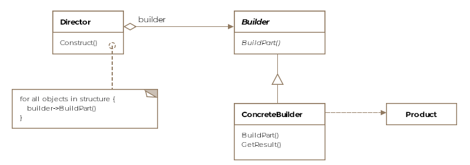
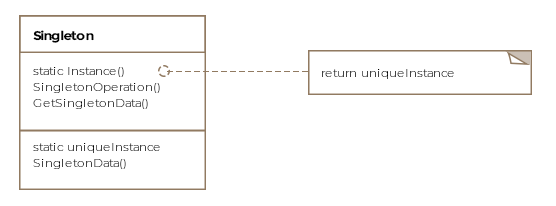

# Software Design Patterns (Các mẫu thiết kế phần mềm)

## Start (Bắt đầu)

### Introduction (Giới thiệu)

#### Why Patterns?

Tại sao chúng ta cần các mẫu? Câu trả lời thẳng thừng là chúng tôi không muốn phát minh lại bánh xe! Các vấn đề xảy ra thường xuyên trong đời sống công nghệ thường có các giải pháp được xác định rõ ràng, linh hoạt, theo mô-đun và dễ hiểu hơn. Những giải pháp này khi được trừu tượng hóa khỏi các chi tiết chiến thuật sẽ trở thành các mẫu thiết kế. Nếu bạn trải qua [déjà vu](https://en.wikipedia.org/wiki/D%C3%A9j%C3%A0_vu) khi thiết kế một giải pháp cho một vấn đề có cảm giác giống một cách kỳ lạ với giải pháp của một vấn đề trước đó, mặc dù ở một lĩnh vực khác, thì có lẽ bạn đang vô tình sử dụng một mẫu.

Dưới đây là hình ảnh thể hiện mối quan hệ giữa các mẫu thiết kế khác nhau như được giải thích bởi các mẫu thiết kế cơ bản do nhóm bốn người thực hiện.


#### Ví dụ

Hãy xem xét một ví dụ để hiểu các mẫu thiết kế là gì và chúng được áp dụng như thế nào. Hàm tạo lớp là một trong những khái niệm cơ bản trong ngôn ngữ hướng đối tượng. Các hàm tạo giúp tạo các đối tượng của lớp và có thể nhận các tham số. Chúng ta hãy lấy lớp sau đây làm ví dụ.

```java
public class Aircraft {

    private String type;

    public Aircraft(String type) {
        this.type = type;
    }
}
```

Trong ví dụ trên, chúng ta có hàm tạo mặc định cho lớp nhận một tham số duy nhất ***type*** của máy bay. Bây giờ, giả sử sau một vài ngày, bạn nhận ra rằng bạn muốn thêm các thuộc tính bổ sung vào Aircraftlớp học. Giả sử bạn muốn thêm màu của máy bay làm thuộc tính, nhưng bạn đã phát hành một phiên bản thư viện của mình và không thể sửa đổi hàm tạo ban đầu. Giải pháp là thêm một hàm tạo khác có hai tham số như vậy

```java
public class Aircraft {

    private String type;
    private String color;

    public Aircraft(String type) {
        this.type = type;
    }

    public Aircraft(String type, String color) {
        this.type = type;
        this.color = color;
    }
}
```

Nếu bạn tiếp tục theo cách này, cuối cùng bạn sẽ có một loạt các hàm tạo với số lượng đối số ngày càng tăng trông giống như một chiếc kính thiên văn:

```java
Aircraft(String type)
Aircraft(String type, String color)
Aircraft(String type, String color, String prop3)
Aircraft(String type, String color, String prop3, String prop4) 
```

Mẫu kính thiên văn được gọi là phản mẫu (anti-pattern): làm thế nào để KHÔNG làm mọi việc! Cách để tiếp cận một lớp có số lượng biến ngày càng tăng là sử dụng Builder Pattern mà chúng ta sẽ thảo luận sâu hơn trong các chương sau.

Các nhà phát triển dày dạn kinh nghiệm dự kiến ​​​​sẽ thành thạo các mẫu thiết kế và việc áp dụng chúng giúp mã có thể tái sử dụng và bảo trì trong tương lai. Các mẫu thiết kế không chỉ giới hạn ở các ngôn ngữ hướng đối tượng mà còn tồn tại trong các lĩnh vực khác của Khoa học Máy tính như hệ thống phân tán, hệ thống dữ liệu lớn hoặc giao diện người dùng.

#### Gợi ý thiết kế hướng đối tượng

Bất cứ khi nào viết mã bằng ngôn ngữ hướng đối tượng, việc tuân theo danh sách đề xuất sau đây sẽ giúp mã của bạn có thể tuân theo các thay đổi mà không tốn nhiều công sức nhất.

- Tách các phần mã khác nhau hoặc thay đổi khỏi các phần mã vẫn giữ nguyên.
- Luôn viết mã theo giao diện và không chống lại việc triển khai cụ thể.
- Đóng gói các hành vi càng nhiều càng tốt.
- Ưu tiên thành phần hơn là thừa kế. Kế thừa có thể dẫn đến sự bùng nổ của các lớp và đôi khi lớp cơ sở được trang bị chức năng mới không thể áp dụng cho một số lớp dẫn xuất của nó.
- Các thành phần tương tác trong hệ thống phải được kết nối lỏng lẻo nhất có thể.
- Lý tưởng nhất là thiết kế lớp nên hạn chế sửa đổi và khuyến khích mở rộng.
- Việc sử dụng các mẫu trong công việc hàng ngày của bạn cho phép trao đổi toàn bộ khái niệm triển khai với các nhà phát triển khác thông qua từ vựng về mẫu được chia sẻ.

Một số gợi ý trên được thể hiện trong các mẫu mà chúng ta sẽ thảo luận trong các bài học sắp tới. Tuy nhiên, hãy nhớ rằng việc làm cho thiết kế của một người trở nên linh hoạt và có khả năng mở rộng tương ứng sẽ làm tăng độ phức tạp và dễ hiểu của cơ sở mã. Người ta phải đi theo ranh giới rõ ràng giữa hai mục tiêu cạnh tranh khi thiết kế và viết phần mềm.

### Types of Design Patterns (Các loại mẫu thiết kế)

#### Introduction

Các mẫu thiết kế cho các chương trình hướng đối tượng được chia thành ba loại lớn được liệt kê dưới đây. Đây là những danh mục tương tự được GoF sử dụng trong nghiên cứu chuyên sâu của họ về các mẫu thiết kế.

- Creational (Sáng tạo)
- Structural (Cấu trúc)
- Behavioral (Hành vi)

Mỗi điều này được giải thích dưới đây:

#### Creational

Các mẫu thiết kế sáng tạo liên quan đến cách các đối tượng được xây dựng từ các lớp. Việc tạo mới các đối tượng nghe có vẻ tầm thường nhưng việc vứt bỏ mã một cách thiếu suy nghĩ với việc tạo phiên bản đối tượng có thể khiến bạn phải đau đầu sau này. Mẫu thiết kế sáng tạo đi kèm với những gợi ý mạnh mẽ về cách tốt nhất để gói gọn quá trình tạo đối tượng trong một chương trình.

- Builder Pattern
- Prototype Pattern
- Singleton Pattern
- Abstract Factory Pattern

#### Structural

Các mẫu cấu trúc liên quan đến thành phần của các lớp, tức là các lớp được tạo thành hoặc xây dựng như thế nào. Bao gồm các mẫu:

- Adapter Pattern
- Bridge Pattern
- Composite Pattern
- Decorator Pattern
- Facade Pattern
- Flyweight Pattern
- Proxy Pattern

#### Behavioral

Các mẫu thiết kế hành vi chỉ ra sự tương tác giữa các lớp và đối tượng với nhau và sự phân công trách nhiệm. Bao gồm các mẫu:

- Interpreter Pattern
- Template Pattern
- Chain of Responsibility Pattern
- Command Pattern
- Iterator Pattern
- Mediator Pattern
- Memento Pattern
- Observer Pattern
- State Pattern
- Strategy Pattern
- Visitor Pattern

#### Examples

Đối với hầu hết các mẫu, chúng tôi mượn các khái niệm từ ngành hàng không để tạo ra các ví dụ của mình. Bạn sẽ thấy khóa học thường xuyên nói về F-16 và Boeing để giải thích các khía cạnh của mô hình đang được thảo luận.

#### For Interview Prep

Đối với những người đang gấp rút tham gia khóa học cho cuộc phỏng vấn sắp tới, tôi khuyên bạn nên xem qua tất cả các creational design patterns, decorator, proxy, iterator, observer và visitor patterns. Khi bạn đọc qua chúng, hãy nhớ xem các ví dụ được chỉ ra trong mỗi bài học.

## Creational Patterns (Các mẫu sáng tạo)

### Builder Pattern

#### What is it?

Đúng như tên gọi, mẫu xây dựng được sử dụng để xây dựng các đối tượng. Đôi khi, các đối tượng chúng ta tạo ra có thể phức tạp, được tạo thành từ nhiều đối tượng phụ hoặc yêu cầu một quy trình xây dựng phức tạp. Việc tạo các kiểu phức tạp có thể được đơn giản hóa bằng cách sử dụng mẫu xây dựng. Đối tượng composite hoặc aggregate là những gì mà người xây dựng thường xây dựng.

Về mặt hình thức, một mẫu trình xây dựng đóng gói hoặc ẩn quá trình xây dựng một đối tượng phức tạp và tách biệt cách biểu diễn đối tượng và cấu trúc của nó. Sự phân tách cho phép chúng ta xây dựng các biểu diễn khác nhau bằng cách sử dụng cùng một quy trình xây dựng. Trong ngôn ngữ Java, các cách biểu diễn khác nhau ngụ ý việc tạo các đối tượng thuộc các lớp khác nhau có thể chia sẻ cùng một quy trình xây dựng.

#### Class Diagram

Sơ đồ lớp dưới đây bao gồm các thực thể sau:

- Builder
- Concrete Builder
- Director
- Product



#### Example

Tiếp tục với ví dụ của chúng ta về máy bay, giả sử việc chế tạo một chiếc máy bay bao gồm ba bước theo thứ tự:

1. chế tạo buồng lái
2. sau đó là động cơ
3. và cuối cùng là đôi cánh

Trong thế giới giả định của chúng ta, mọi máy bay đều yêu cầu ít nhất ba bước trên. Tuy nhiên, máy bay chở khách có thể có thêm một bước là làm phòng tắm trên máy bay. Các bước thể hiện quá trình xây dựng (**construction**) theo định nghĩa chính thức của chúng tôi. Sản phẩm (**Product**) này là một chiếc máy bay nhưng có thể có nhiều hình dáng (**representations**) khác nhau như F-16 hoặc Boeing-747. Sử dụng cùng một quy trình xây dựng, chúng ta sẽ có thể sản xuất cả F-16 và Boeing.

Bây giờ chúng ta hãy xem một số mã. Đầu tiên chúng ta sẽ bắt đầu với lớp trừu tượng **AircraftBuilder**. Trình xây dựng chứa một phương thức cho từng thành phần có thể là một phần của sản phẩm cuối cùng. Các phương thức này được các **concrete builder** ghi đè có chọn lọc tùy thuộc vào việc liệu các nhà xây dựng (**builders**) có đưa phần đó vào biến thể sản phẩm cuối cùng mà họ chịu trách nhiệm xây dựng hay không.

```java
public abstract class AircraftBuilder {

    public void buildEngine() {

    }

    public void buildWings() {

    }

    public void buildCockpit() {

    }

    public void buildBathrooms() {

    }

    abstract public IAircraft getResult();
}
```

Bây giờ chúng tôi sẽ triển khai hai concrete builders, một cho F-16 và một cho Boeing-747.

```java
public class Boeing747Builder extends AircraftBuilder {

    Boeing747 boeing747;

    @Override
    public void buildCockpit() {

    }

    @Override
    public void buildEngine() {

    }

    @Override
    public void buildBathrooms() {
        
    }

    @Override
    public void buildWings() {

    }

    public IAircraft getResult() {
        return boeing747;
    }
}

public class F16Builder extends AircraftBuilder {

    F16 f16;

    @Override
    public void buildEngine() {
        // get F-16 an engine
        // f16.engine = new F16Engine();
    }

    @Override
    public void buildWings() {
        // get F-16 wings
        // f16.wings = new F16Wings();
    }

    @Override
    public void buildCockpit() {
        f16 = new F16();
        // get F-16 a cockpit
        // f16.cockpit = new F16Cockpit();
    }

    public IAircraft getResult() {
        return f16;
    }
}
```

Để cho ngắn gọn, chúng tôi đã cung cấp bộ khung của các builders và bỏ qua việc triển khai riêng lẻ từng phương thức. Lưu ý **F16Builder** không ghi đè phương thức **buildBathrooms**, vì không có phòng tắm trong buồng lái F-16. Builder của Boeing đã ghi đè phương thức này vì máy bay Boeing-747 có phòng tắm cho hành khách.

Quá trình hoặc thuật toán cần thiết để chế tạo chiếc máy bay trong trường hợp này là thứ tự cụ thể trong đó các bộ phận khác nhau được tạo ra sẽ được một lớp khác gọi là lớp **Director**. The director theo một nghĩa nào đó là chỉ đạo việc chế tạo chiếc máy bay. Sản phẩm cuối cùng vẫn được người xây dựng trả lại.

```java
public class Director {

    AircraftBuilder aircraftBuilder;

    public Director(AircraftBuilder aircraftBuilder) {
        this.aircraftBuilder = aircraftBuilder;
    }

    public void construct(boolean isPassenger) {
        aircraftBuilder.buildCockpit();
        aircraftBuilder.buildEngine();
        aircraftBuilder.buildWings();

        if (isPassenger)
            aircraftBuilder.buildBathrooms();
    }
}
```

Lưu ý cách chúng tôi có thể chuyển giao builder theo lựa chọn của mình và thay đổi aircraft product (representation) thành F-16 hoặc Boeing-747. Trong trường hợp của chúng tôi, các nhà xây dựng trả về cùng một siêu kiểu, tuy nhiên điều đó có thể không xảy ra nếu các nhà xây dựng trả lại các sản phẩm không giống nhau lắm.

Client sẽ sử dụng mẫu như vậy:

```java
public class Client {

    public void main() {

        F16Builder f16Builder = new F16Builder();
        Director director = new Director(f16Builder);
        director.construct(false);

        IAircraft f16 = f16Builder.getResult();
    }
}
```

Giao diện **AircraftBuilder** ẩn cách một chiếc máy bay nhất định được chế tạo. Client không biết về các lớp **F16Engine**, **F16Cockpit** và các hạng tương tự dành cho **Boeing-747**.

#### Skipping the Director

Bạn có thể thấy **Builder Pattern** đang được sử dụng mà không có **director**. Client có thể trực tiếp khởi tạo builder và gọi các phương thức cần thiết để có được sản phẩm cho chính nó. Đây là một liều thuốc giải độc phổ biến cho các nhà xây dựng kính thiên văn (telescoping constructors). Hãy tưởng tượng một lớp có quá nhiều thuộc tính nhưng một số thuộc tính được đặt tùy chọn. Trong trường hợp như vậy, builder có thể được gọi để chỉ đặt các thuộc tính bắt buộc và tạo sản phẩm

#### Other Examples

- API Java cho thấy lớp **StringBuilder** không thực sự tuân thủ cách đọc nghiêm ngặt của Gof builder pattern, nhưng vẫn có thể được coi là một ví dụ về nó. Sử dụng StringBuilder, chúng ta có thể tạo một chuỗi liên tiếp bằng cách sử dụng phương thức append().
- Một ví dụ giả định khác có thể là tạo tài liệu thuộc loại pdf hoặc html. Hãy xem xét đoạn trích dưới đây:

```java
public IDocument construct(DocumentBuilder documentBuilder) {

    documentBuilder.addTitle("Why use design patterns");
    documentBuilder.addBody("blah blah blah... more blah blah blah");
    documentBuilder.addAuthor("C. H. Afzal");
    documentBuilder.addConclusion("Happy Coding!");
        
    // Return the document and depending on the concrete
    // implementation of the DocumentBuilder, we could return
    // either a pdf or html document.
    return documentBuilder.buildDocument();  
}
```

Phương thức trên có thể xuất hiện trong mã director hoặc mã client và các loại tài liệu khác nhau có thể được xây dựng bằng cách thay đổi loại cụ thể của **DocumentBuilder** được truyền vào phương thức. Chúng ta có thể có một **HtmlDocumentBuilder** và một **PdfDocumentBuilder** bắt nguồn từ lớp trừu tượng **DocumentBuilder**.

#### Caveats

Builder Pattern có thể trông giống với Abstract Factory Pattern, nhưng có một điểm khác biệt là builder pattern tạo đối tượng theo từng bước trong khi abstract factory pattern trả về đối tượng trong một lần.

### Singleton Pattern

#### What is it?

Mẫu Singleton như tên gợi ý được sử dụng để tạo một và duy nhất một phiên bản của một lớp. Có một số ví dụ trong đó chỉ tồn tại một phiên bản duy nhất của một lớp và ràng buộc được thực thi. Bộ nhớ đệm (caches), nhóm luồng (thread pools), sổ đăng ký (registries) là những ví dụ về các đối tượng chỉ nên có một phiên bản duy nhất.

Việc tạo mới một đối tượng của một lớp là chuyện bình thường nhưng làm cách nào để đảm bảo rằng chỉ có một đối tượng được tạo? Câu trả lời là đặt hàm tạo ở chế độ private. Bằng cách đó, chỉ các thành viên của lớp mới có thể truy cập vào hàm tạo riêng và không ai khác có thể truy cập được.

Về mặt hình thức, mẫu Singleton được định nghĩa là **đảm bảo rằng chỉ tồn tại một phiên bản duy nhất của một lớp và tồn tại một điểm truy cập toàn cầu vào nó**.

#### Class Diagram

Sơ đồ lớp chỉ bao gồm một thực thể duy nhất:



#### Example

Giả sử chúng tôi muốn lập mô hình chiếc máy bay chính thức của Tổng thống Mỹ có tên là "Airforce One" trong phần mềm của chúng tôi. Chỉ có thể có một phiên bản của Airforce One và một lớp singleton là cách thể hiện phù hợp nhất.

Dưới đây là mã cho lớp singleton của chúng tôi

```java
public class AirforceOne {

    // The sole instance of the class
    private static AirforceOne onlyInstance;

    // Make the constructor private so its only accessible to
    // members of the class.
    private AirforceOne() {
    }

    public void fly() {
        System.out.println("Airforce one is flying...");
    }

    // Create a static method for object creation
    public static AirforceOne getInstance() {

        // Only instantiate the object when needed.
        if (onlyInstance == null) {
            onlyInstance = new AirforceOne();
        }

        return onlyInstance;
    }
}

public class Client {

    public void main() {
        AirforceOne airforceOne = AirforceOne.getInstance();
        airforceOne.fly();
    }
}
```

#### Multithreading and Singleton

Đoạn mã trên sẽ hoạt động rất tốt miễn là ứng dụng chỉ chạy một luồng. Ngay khi nhiều luồng bắt đầu sử dụng lớp, có khả năng nhiều đối tượng sẽ được tạo. Đây là một kịch bản ví dụ:

- Luồng A gọi phương thức getInstance và tìm thấy onlyInstance là null nhưng trước khi nó thực sự khởi tạo đối tượng, nó sẽ tắt ngữ cảnh (context switched out).
- Bây giờ luồng B xuất hiện và gọi getInstancephương thức và tiếp tục khởi tạo và trả về đối tượng AirforceOne .
- Khi luồng A được lên lịch lại, đó là lúc trò nghịch ngợm bắt đầu. Luồng đã vượt qua kiểm tra điều kiện if null và sẽ tiến hành tạo một đối tượng khác của AirforceOne và gán nó cho onlyInstance. Bây giờ có hai đối tượng AirforceOne khác nhau, một cái được tạo bởi luồng A và một cái được tạo bởi luồng B.

Có hai cách nhỏ để khắc phục tình trạng này:

- Một là thêm **synchronized** vào đầu phương thức getInstance().

```java
synchronized public static AirforceOne getInstance()
```

- Cách khác là thực hiện khởi tạo tĩnh phiên bản, được đảm bảo an toàn cho luồng.

```java
// The sole instance of the class
private static AirforceOne onlyInstance = new AirforceOne();
```

Vấn đề với các phương pháp trên là việc đồng bộ hóa tốn kém và việc khởi tạo tĩnh sẽ tạo ra đối tượng ngay cả khi nó không được sử dụng trong một lần chạy ứng dụng cụ thể. Nếu việc tạo đối tượng tốn kém thì việc thiết lập tĩnh có thể khiến chúng ta mất hiệu suất.

#### Double-Checked Locking

Sự phát triển tiếp theo của singleton pattern sẽ chỉ đồng bộ hóa khi đối tượng được tạo lần đầu tiên và nếu nó đã được tạo thì chúng tôi không cố gắng đồng bộ hóa các luồng truy cập. Mẫu này có tên gọi là "double-checked locking".

```java
public class AirforceOneWithDoubleCheckedLocking {

    // The sole instance of the class. Note its marked volatile
    private volatile static AirforceOneWithDoubleCheckedLocking onlyInstance;

    // Make the constructor private so its only accessible to
    // members of the class.
    private AirforceOneWithDoubleCheckedLocking() {
    }

    public void fly() {
        System.out.println("Airforce one is flying...");
    }

    // Create a static method for object creation
    synchronized public static AirforceOneWithDoubleCheckedLocking getInstance() {

        // Only instantiate the object when needed.
        if (onlyInstance == null) {
            // Note how we are synchronizing on the class object
            synchronized (AirforceOneWithDoubleCheckedLocking.class) {
                if (onlyInstance == null) {
                    onlyInstance = new AirforceOneWithDoubleCheckedLocking();
                }
            }
        }

        return onlyInstance;
    }
}
```

Giải pháp trên đánh dấu cá thể đơn lẻ không ổn định tuy nhiên JVM volatile triển khai cho Java phiên bản 1.4 sẽ không hoạt động chính xác đối với khóa được kiểm tra kép và bạn sẽ cần sử dụng một cách khác để tạo các singleton của mình.

Khóa kiểm tra kép hiện được coi là một phản mẫu và tiện ích của nó phần lớn đã không còn do thời gian khởi động JVM đã tăng lên trong những năm qua.

#### Other Examples

Trong API Java, chúng tôi có các singleton sau:

- java.lang.Runtime
- java.awt.Desktop

#### Caveats

Có thể phân lớp một lớp đơn bằng cách đặt hàm tạo được bảo vệ thay vì riêng tư. Nó có thể phù hợp trong một số trường hợp. Một cách tiếp cận được thực hiện trong các tình huống này là tạo một sổ đăng ký gồm các lớp con của các lớp con và phương thức getInstance có thể lấy tham số hoặc sử dụng biến môi trường để trả về singleton mong muốn. Registry duy trì ánh xạ tên chuỗi tới các đối tượng đơn lẻ.

### Prototype Pattern

### Factory Method Pattern

### Abstract Factory Pattern

## Structural Patterns

### Adapter Pattern

### Bridge Pattern

### Composite Pattern

### Decorator Pattern

### Facade Pattern

### Flyweight

### Proxy Pattern

## Behavioral Patterns

### Chain of Responsibility Pattern

### Observer Pattern

### Interpreter Pattern

### Command Pattern

### Iterator Pattern

### Mediator Pattern

### Memento Pattern

### State Pattern

### Template Method

### Strategy Pattern

### Visitor Pattern

## The End

### Summary

### Epilogue
