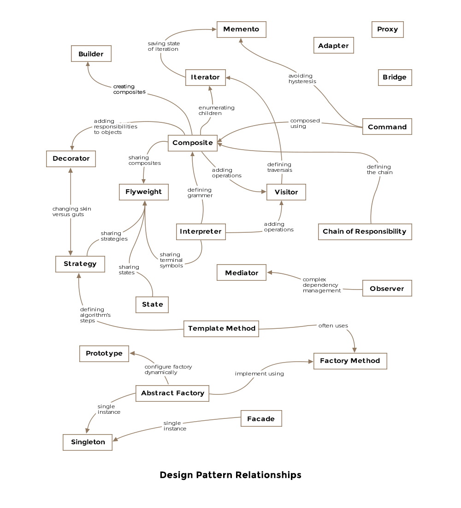

# Software Design Patterns (Các mẫu thiết kế phần mềm)

## Start (Bắt đầu)

### Introduction (Giới thiệu)

#### Why Patterns?

Tại sao chúng ta cần các mẫu? Câu trả lời thẳng thừng là chúng tôi không muốn phát minh lại bánh xe! Các vấn đề xảy ra thường xuyên trong đời sống công nghệ thường có các giải pháp được xác định rõ ràng, linh hoạt, theo mô-đun và dễ hiểu hơn. Những giải pháp này khi được trừu tượng hóa khỏi các chi tiết chiến thuật sẽ trở thành các mẫu thiết kế. Nếu bạn trải qua [déjà vu](https://en.wikipedia.org/wiki/D%C3%A9j%C3%A0_vu) khi thiết kế một giải pháp cho một vấn đề có cảm giác giống một cách kỳ lạ với giải pháp của một vấn đề trước đó, mặc dù ở một lĩnh vực khác, thì có lẽ bạn đang vô tình sử dụng một mẫu.

Dưới đây là hình ảnh thể hiện mối quan hệ giữa các mẫu thiết kế khác nhau như được giải thích bởi các mẫu thiết kế cơ bản do nhóm bốn người thực hiện.



#### Ví dụ

Hãy xem xét một ví dụ để hiểu các mẫu thiết kế là gì và chúng được áp dụng như thế nào. Hàm tạo lớp là một trong những khái niệm cơ bản trong ngôn ngữ hướng đối tượng. Các hàm tạo giúp tạo các đối tượng của lớp và có thể nhận các tham số. Chúng ta hãy lấy lớp sau đây làm ví dụ.

```java
public class Aircraft {

    private String type;

    public Aircraft(String type) {
        this.type = type;
    }
}
```

Trong ví dụ trên, chúng ta có hàm tạo mặc định cho lớp nhận một tham số duy nhất ***type*** của máy bay. Bây giờ, giả sử sau một vài ngày, bạn nhận ra rằng bạn muốn thêm các thuộc tính bổ sung vào Aircraftlớp học. Giả sử bạn muốn thêm màu của máy bay làm thuộc tính, nhưng bạn đã phát hành một phiên bản thư viện của mình và không thể sửa đổi hàm tạo ban đầu. Giải pháp là thêm một hàm tạo khác có hai tham số như vậy

```java
public class Aircraft {

    private String type;
    private String color;

    public Aircraft(String type) {
        this.type = type;
    }

    public Aircraft(String type, String color) {
        this.type = type;
        this.color = color;
    }
}
```

Nếu bạn tiếp tục theo cách này, cuối cùng bạn sẽ có một loạt các hàm tạo với số lượng đối số ngày càng tăng trông giống như một chiếc kính thiên văn:

```java
Aircraft(String type)
Aircraft(String type, String color)
Aircraft(String type, String color, String prop3)
Aircraft(String type, String color, String prop3, String prop4) 
```

Mẫu kính thiên văn được gọi là phản mẫu (anti-pattern): làm thế nào để KHÔNG làm mọi việc! Cách để tiếp cận một lớp có số lượng biến ngày càng tăng là sử dụng Builder Pattern mà chúng ta sẽ thảo luận sâu hơn trong các chương sau.

Các nhà phát triển dày dạn kinh nghiệm dự kiến ​​​​sẽ thành thạo các mẫu thiết kế và việc áp dụng chúng giúp mã có thể tái sử dụng và bảo trì trong tương lai. Các mẫu thiết kế không chỉ giới hạn ở các ngôn ngữ hướng đối tượng mà còn tồn tại trong các lĩnh vực khác của Khoa học Máy tính như hệ thống phân tán, hệ thống dữ liệu lớn hoặc giao diện người dùng.

#### Gợi ý thiết kế hướng đối tượng

Bất cứ khi nào viết mã bằng ngôn ngữ hướng đối tượng, việc tuân theo danh sách đề xuất sau đây sẽ giúp mã của bạn có thể tuân theo các thay đổi mà không tốn nhiều công sức nhất.

- Tách các phần mã khác nhau hoặc thay đổi khỏi các phần mã vẫn giữ nguyên.
- Luôn viết mã theo giao diện và không chống lại việc triển khai cụ thể.
- Đóng gói các hành vi càng nhiều càng tốt.
- Ưu tiên thành phần hơn là thừa kế. Kế thừa có thể dẫn đến sự bùng nổ của các lớp và đôi khi lớp cơ sở được trang bị chức năng mới không thể áp dụng cho một số lớp dẫn xuất của nó.
- Các thành phần tương tác trong hệ thống phải được kết nối lỏng lẻo nhất có thể.
- Lý tưởng nhất là thiết kế lớp nên hạn chế sửa đổi và khuyến khích mở rộng.
- Việc sử dụng các mẫu trong công việc hàng ngày của bạn cho phép trao đổi toàn bộ khái niệm triển khai với các nhà phát triển khác thông qua từ vựng về mẫu được chia sẻ.

Một số gợi ý trên được thể hiện trong các mẫu mà chúng ta sẽ thảo luận trong các bài học sắp tới. Tuy nhiên, hãy nhớ rằng việc làm cho thiết kế của một người trở nên linh hoạt và có khả năng mở rộng tương ứng sẽ làm tăng độ phức tạp và dễ hiểu của cơ sở mã. Người ta phải đi theo ranh giới rõ ràng giữa hai mục tiêu cạnh tranh khi thiết kế và viết phần mềm.

### Types of Design Patterns (Các loại mẫu thiết kế)

#### Introduction

Các mẫu thiết kế cho các chương trình hướng đối tượng được chia thành ba loại lớn được liệt kê dưới đây. Đây là những danh mục tương tự được GoF sử dụng trong nghiên cứu chuyên sâu của họ về các mẫu thiết kế.

- Creational (Sáng tạo)
- Structural (Cấu trúc)
- Behavioral (Hành vi)

Mỗi điều này được giải thích dưới đây:

#### Creational

Các mẫu thiết kế sáng tạo liên quan đến cách các đối tượng được xây dựng từ các lớp. Việc tạo mới các đối tượng nghe có vẻ tầm thường nhưng việc vứt bỏ mã một cách thiếu suy nghĩ với việc tạo phiên bản đối tượng có thể khiến bạn phải đau đầu sau này. Mẫu thiết kế sáng tạo đi kèm với những gợi ý mạnh mẽ về cách tốt nhất để gói gọn quá trình tạo đối tượng trong một chương trình.

- Builder Pattern
- Prototype Pattern
- Singleton Pattern
- Abstract Factory Pattern

#### Structural

Các mẫu cấu trúc liên quan đến thành phần của các lớp, tức là các lớp được tạo thành hoặc xây dựng như thế nào. Bao gồm các mẫu:

- Adapter Pattern
- Bridge Pattern
- Composite Pattern
- Decorator Pattern
- Facade Pattern
- Flyweight Pattern
- Proxy Pattern

#### Behavioral

Các mẫu thiết kế hành vi chỉ ra sự tương tác giữa các lớp và đối tượng với nhau và sự phân công trách nhiệm. Bao gồm các mẫu:

- Interpreter Pattern
- Template Pattern
- Chain of Responsibility Pattern
- Command Pattern
- Iterator Pattern
- Mediator Pattern
- Memento Pattern
- Observer Pattern
- State Pattern
- Strategy Pattern
- Visitor Pattern

#### Examples

Đối với hầu hết các mẫu, chúng tôi mượn các khái niệm từ ngành hàng không để tạo ra các ví dụ của mình. Bạn sẽ thấy khóa học thường xuyên nói về F-16 và Boeing để giải thích các khía cạnh của mô hình đang được thảo luận.

#### For Interview Prep

Đối với những người đang gấp rút tham gia khóa học cho cuộc phỏng vấn sắp tới, tôi khuyên bạn nên xem qua tất cả các creational design patterns, decorator, proxy, iterator, observer và visitor patterns. Khi bạn đọc qua chúng, hãy nhớ xem các ví dụ được chỉ ra trong mỗi bài học.

## Creational Patterns (Các mẫu sáng tạo)

### Builder Pattern

### Singleton Pattern

### Prototype Pattern

### Factory Method Pattern

### Abstract Factory Pattern

## Structural Patterns

### Adapter Pattern

### Bridge Pattern

### Composite Pattern

### Decorator Pattern

### Facade Pattern

### Flyweight

### Proxy Pattern

## Behavioral Patterns

### Chain of Responsibility Pattern

### Observer Pattern

### Interpreter Pattern

### Command Pattern

### Iterator Pattern

### Mediator Pattern

### Memento Pattern

### State Pattern

### Template Method

### Strategy Pattern

### Visitor Pattern

## The End

### Summary

### Epilogue
